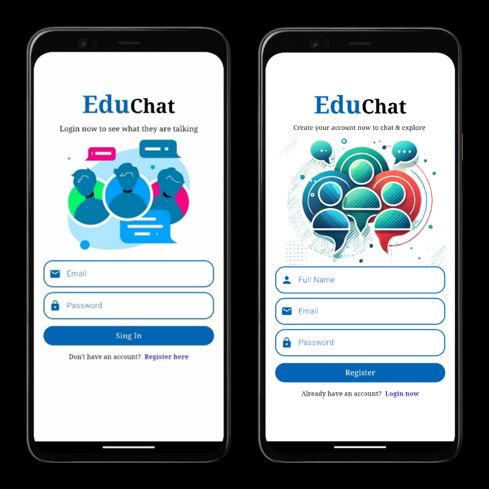
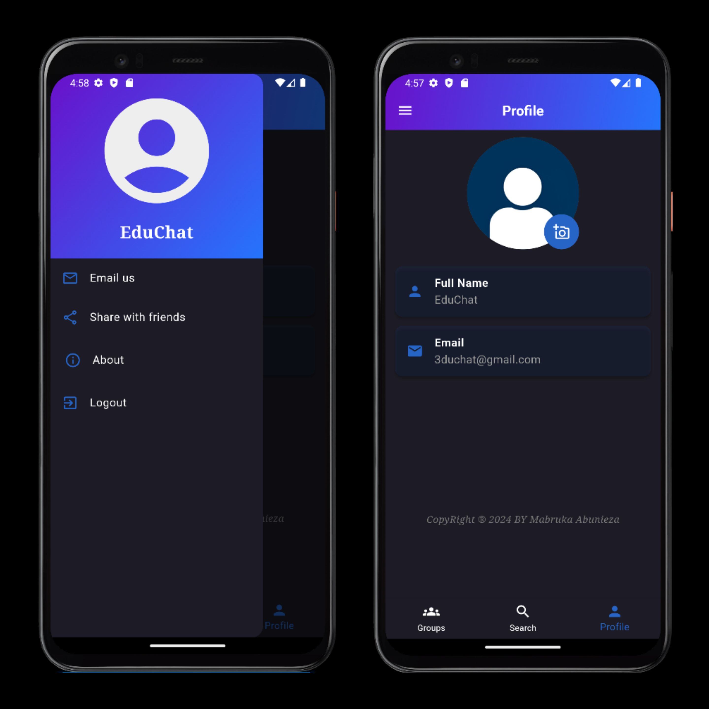
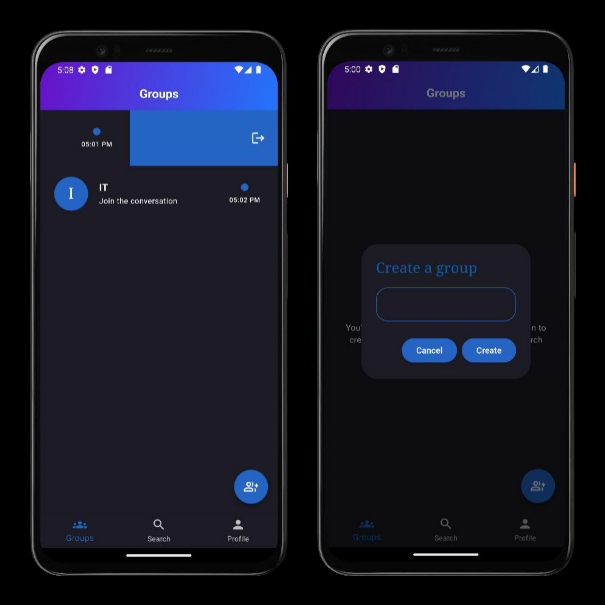
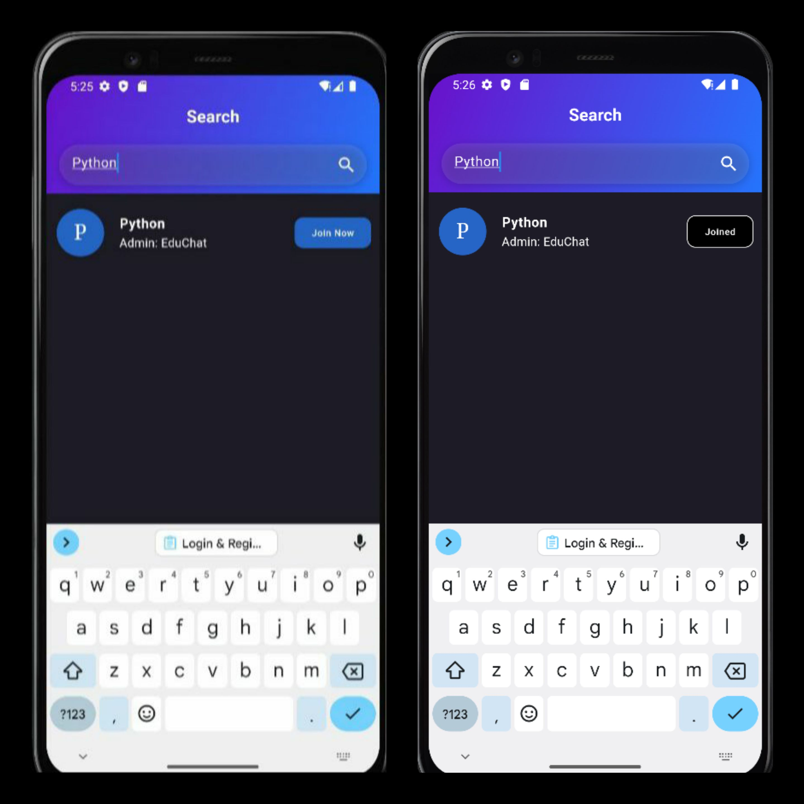
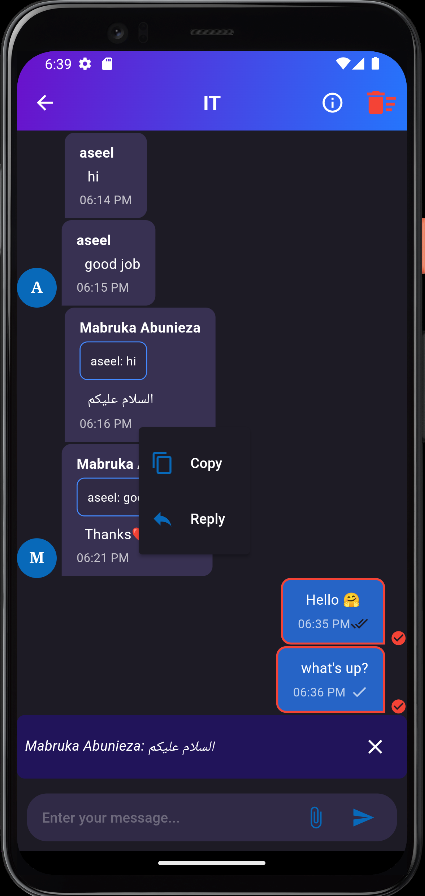
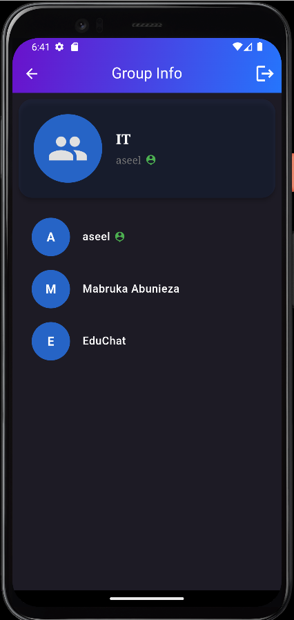

# EduChat Application

## Overview
A group chat application that allows users to join or create chat groups, send messages, and manage group settings. The app is designed to provide an intuitive and user-friendly interface with multiple features for effective communication and group management.

---

## Features

### **1. Login & Register Screens**
#### Screenshot:

### **2. Profile Screen**
- Displays the user's name and email.
- Allows users to update their profile picture.
- Provides an option to log out from the app.

#### Screenshot:

### **3. Main Screen**
- Displays all the groups the user has joined.
- Features for creating a new group.
- Shows unread messages with timestamps and the sender's name.
- Enables leaving a group by swiping left on the group name.
- Deletes a group entirely if the admin leaves it.

#### Screenshot:

### **4. Search Groups Screen**
- Allows users to search and explore available groups to join.

#### Screenshot:

### **5. Chat Screen**
- Supports sending and receiving messages and files.
- Provides options to:
  - Delete messages.
  - Reply to specific messages.
  - Copy messages.
  - Select multiple messages to delete them in bulk.
- Displays the read/unread status of messages.

#### Screenshot:

### **6. Group Information Screen**
- Displays group details, including:
  - Group name.
  - Admin details.
  - List of group members.
- Allows the admin to change the group picture.
- Provides an option for members to leave the group.

#### Screenshot:

---

## Group Management
- Members can leave groups at any time.
- Groups are automatically deleted if the admin leaves.
- New groups can be created through the main screen.

---

## Messaging Features
- Real-time messaging with status indicators for "read" or "unread."
- File sharing support for enhanced communication.
- Easy message management with delete, reply, and copy options.
- Bulk deletion of messages for better organization.

---

## Technical Notes
- The app ensures that only the admin can make administrative changes, such as changing the group picture.
- Groups dynamically update when users join or leave, ensuring real-time synchronization.
- Notifications and visual indicators are provided for unread messages.
- The app is designed to be user-friendly and visually appealing, with a clean and intuitive interface.

## APK Download
You can download the APK file for the application from the link below:
[Download APK](app-release.apk)

---

## GitHub Repository
For more details, you can access the source code on GitHub:

[GitHub Repository](https://github.com/your-repo-link)

---